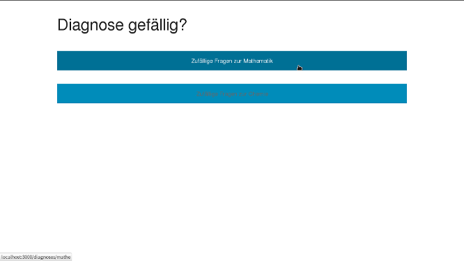
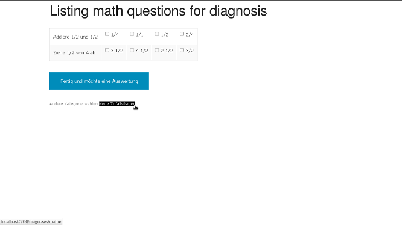
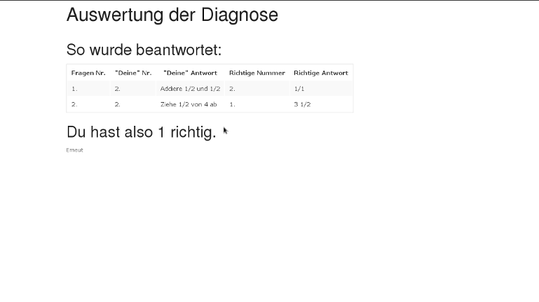

# diagnose! BETA

A simple app for running diagnoses.
This app is everything but ready, so dont put too much work into it before checking the code yourself.

## Table of contents

 - [Quick start](#quick-start)
 - [Requirements](#reguirements)
 - [Documentation](#documentation)
 - [Screenshots](#screenshots)
 - [ToDo](#todo)
 - [How it works](#how-it-works)
 - [AuthorS](#authorS)
 - [Copyright and license](#copyright-and-license)

## Requirements

Since this app uses LaTeX (rails-latex gem) you need LaTeX running on your server in order to create exercise sheets.

## Quick start

- Clone the repo: `git clone https://github.com/nedab/diagnose.git`.
- Create your own database.yml - just use a rails 4 one with sqlite3 settings e.g.
- run `rake db:create`, `rake db:migrate` and `rake db:seed`

## Documentation

There are some URL you should know:

* root is put to /diagnoses/index
* put in some ToDos or blog like notes: http://localhost:3000/mains
* putting questions into the database: http://localhost:3000/questions
* create and see categories http://localhost:3000/categories
* running a diagnosis: http://localhost:3000/diagnoses
* getting a (hardcoded) random diagnosis in math http://localhost:3000/diagnoses/mathe
* getting a (hardcoded) random diagnosis in chemistry http://localhost:3000/diagnoses/chemie

Forgive me for not being THAT clear with my names, e.g. sindular and plural form for I am a german and the program started out in my native language.

## Screenshots

### diagnoses#index

### diagnoses#math

### diagnoses#create -> render "diagnosed"

## ToDo

* establishing a whole site around the checklist core like user management etc.
* storing the results in a database rather than a session variable
* use friendlyID and create categories dynamically
* cleanup some code (e.g. devide ruby and ERB/HAML view code)

## How it works

There are two databases with categories and questions which are associated.
The diagnosis is created through questions model and sends an array to diagnoses controller.
That array is processed and send to diagnosed view.

The questions model has several columns, at least four for possible answers and on integer with a "pointer" to the right one.
When the boxes are checked they create a list of parameters which is evaluated and put into an two dimensional array stored in a session variable, also stored is the count of right answers.

The diagnosed view shows these arrays and gives you also the right answer.
That is done by evaluating the array by a case method.

The exercises sheet is created through a latex controller, and the code is messy, but it works.

## AuthorS

So far its just me, but I am happy to share ;)
And I am a hobby programmer who is working as a teacher, therefore you cant expect wonders since I am new to github as well.

## Copyright and license

Its the AGPL v3 as you can find/see in the [LICENSE](https://www.gnu.org/licenses/agpl.txt) file.
The reason is the so called "ASP loophole", this software now has to be published even when used as a web service... or something like that.
